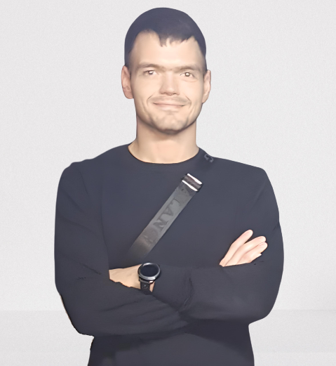

# Semen Anikin  
**Junior Front-end Developer**  

## Contact

## Summary
* **2013 &mdash; 2019**  
Chief Financial Officer  
[**Japonica**](https://japonica.ru/)  
_Budgeting, cash flow, balance, control and work with receivables and payables, financial transactions (banking and cash). Participation in solving the administrative and economic activities of the company: exhibitions, inventories, meetings with business partners, staff training, etc._

* **2018 &mdash; present**  
Private investor  
_Implementation of transactions in the stock and currency markets. Formation of a portfolio of long-term and short-term investments, as well as a portfolio of dividend stocks.
From February 2022 to the present, I have temporarily stopped all investment operations._  

* **2021 &mdash; present**  
Individual entrepreneur  
_Managing the activities of the entire company supplying small quantities of maternity and household products.
Formation of a matrix of goods. Preparation of product cards. Coordination of orders and control of their execution. Pre-sale preparation of goods. Inventory. Implementation of shipments and preparation of documentation. Making report. Conducting settlements with suppliers and contractors. Implementation of deliveries to the consumer._

* **December, 2021 &mdash; present**  
_I am living in Warsaw, Poland.  
I am learning Polish. Student of the specialty "Medical caregiver"._

* **February, 2022 &mdash; present**  
_I actively study the basics of programming and learn the basics of Front-end development. I strive to be realized in the field of IT and wish to be involved in achieving global success in international projects._

&nbsp; 